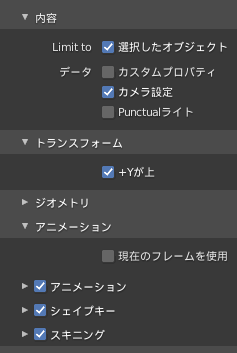

# Camera animation

Blenderで書き出したカメラのアニメーションをスクロールで再生する

## Blenderでのアニメーション書き出し
アニメーション作成は省略

### アニメーションを `パスに追従` で作成した場合
アニメーションをベイクする必要がある  
カメラを選択した状態で `オブジェクト` > `アニメーション` > `アクションをベイク` を選択  
`アクションをベイク` の設定
- フレームは適宜調整（気にするの最終フレームぐらい）
- `ビジュアルキーイング` `コンストレイントをクリア` にチェック
- データをベイク: `オブジェクト` を選択

### glTFで書き出す
エクスポートの設定  


## Three.jsでの設定

### 読み込んだglTFの構造
```text
root
├─ scene
│   └─ Camera（Object3D）
│       └─ Camera_Orientation（Camera）
├─ cameras
│   └─ Camera_Orientation（Camera）
└─ animations
```

- sceneとcamerasのCamera_Orientationは同じ
- 実際のカメラはCamera_Orientation
- CameraはObject3Dでこれがアニメーションする
- BlenderとThree.jsでY,Z軸が違い、書き出しで `+Yが上` を設定したのでこの構造になる

### glTFのデータを反映
```js
// アニメーションさせるObjectを作成
const parent = new THREE.Object3D()
const mixer = new THREE.AnimationMixer(parent)
const action = mixer.clipAction(gltf.animations[0])
action.play()
action.paused = true // 再生してすぐに止めておく

// カメラを作成
const camera = new THREE.PerspectiveCamera()
camera.rotation.copy(gltf.cameras[0].rotation) // カメラの回転をコピー
```

### スクロールに合わせてアニメーションを再生
スクロール量をいい感じにアニメーションの時間に変換するのは省略  

```js
// tickやupdate内でアニメーションを更新
action.time = time // いい感じに変換した時間を設定
mixer.update(deltaTime)
```
